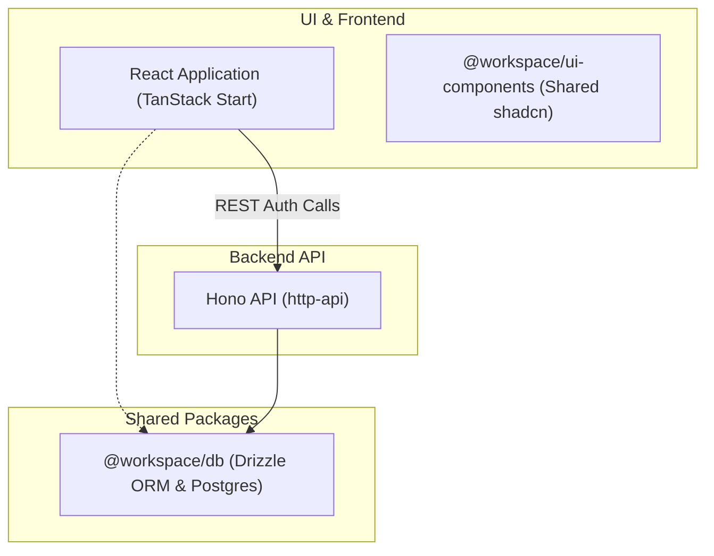

# Project Documentation & Conventions

This monorepo template integrates a **Hono.js API** backend with a **React (TanStack Start & Vite)** frontend, sharing a database configuration via Drizzle ORM. Authentication is managed using **Better Auth**.

---

## Workspace Architecture



### 1. Backend Service (`/api/http-api`)

- Built with **Hono.js** running on port `3007`.
- Better Auth server instance is configured to handle authentications at `/auth/*` (e.g. `/auth/login-email`, `/auth/sign-up-email`, etc.).
- Connects to Postgres using the shared database package.

### 2. React Frontend App (`/ui/apps/react-app`)

- Built with **TanStack Router** (Vite & React 19) as a client-side SPA running on port `3000` (no SSR).
- Client-side auth is handled by `@better-auth/react` client pointing to the Hono auth endpoints (`http://localhost:3007/auth`).
- Frontend does not connect to the database directly; it relies strictly on REST API calls to Hono for session and authentication status.

### 3. Database Package (`/packages/db`)

- Shared package named `@workspace/db`.
- Houses the Drizzle schema, relations, and the base pg-core database client connection.
- Allows both Hono API and TanStack Start backend rendering to query the same database tables.

---

## File Naming Conventions

To maintain a consistent and scalable codebase, follow these naming conventions:

### 1. Components & UI Files

- Filenames should use **kebab-case** representing their purpose (e.g. `login-form.tsx`, `signup-form.tsx`, `button.tsx`).
- React component functions should be exported as **PascalCase** named exports:
  ```typescript
  export function LoginForm() { ... }
  ```

### 2. Routes (TanStack Router)

- Route file names should match the URL path structure using **kebab-case** (e.g. `forgot-password.tsx`, `reset-password.tsx`, `verify-email.tsx`).
- Main component inside a route file should have a name corresponding to the route (e.g. `ForgotPassword`, `ResetPassword`).

### 3. Database Schemas & Migrations

- Schema files in `@workspace/db` should use the format **`[name].schema.ts`** in kebab-case (e.g. `auth.schema.ts`).
- Schema indexes should be imported and re-exported from `packages/db/src/schema/index.ts`.

### 4. Utilities & Config Files

- Utility files should be **kebab-case** (e.g. `auth-client.ts`, `route-helpers.ts`).

---

## Authentication Flows

### 1. Signup Flow

- User fills the registration form at `/signup`.
- The frontend client calls `authClient.signUp.email(...)`.
- Hono backend registers the user in Postgres and outputs the verification URL to the console (for development).
- User visits the verification link, which hits `/verify-email?token=...` on the frontend, verifying the account.

### 2. Login Flow

- User fills `/login` with credentials.
- Client calls `authClient.signIn.email(...)` pointing to the Hono API.
- Upon success, the client navigates to the protected `/dashboard` route.

### 3. Password Reset Flow

- User enters their email at `/forgot-password`.
- Client calls `authClient.requestPasswordReset(...)` with a redirect URL pointing to `/reset-password`.
- Hono backend logs the reset link to the console.
- User clicks the link, enters their new password at `/reset-password?token=...`, and the password is secure-hashed in the database.

---

## Full-Stack Type Safety via Hono RPC

To write or query backend APIs type-safely in the frontend application, we use **Hono RPC**.

### 1. Backend Route Integration
- When building new API endpoints, register them as chained route segments on the Hono `routes` instance inside [main.ts](file:///c:/Users/sahil/Desktop/projects/react-hono-betterauth-monorepo/api/http-api/src/main.ts).
- Export the type definition: `export type AppType = typeof routes;`.
- **CRITICAL**: Use relative imports inside the backend workspace for any files that are part of the exported `AppType` chain (e.g. `./middleware/auth` instead of `@/middleware/auth`). This allows consumer packages in the monorepo to resolve types natively without alias translation errors.

### 2. Frontend Consumption
- Import the typed RPC client and/or Better Auth client from the shared `@workspace/ui-clients` package:
  ```typescript
  import { api, authClient } from '@workspace/ui-clients'
  ```
- Make calls using type-safe paths:
  ```typescript
  const res = await api.users.me.$get()
  const data = await res.json()
  ```
